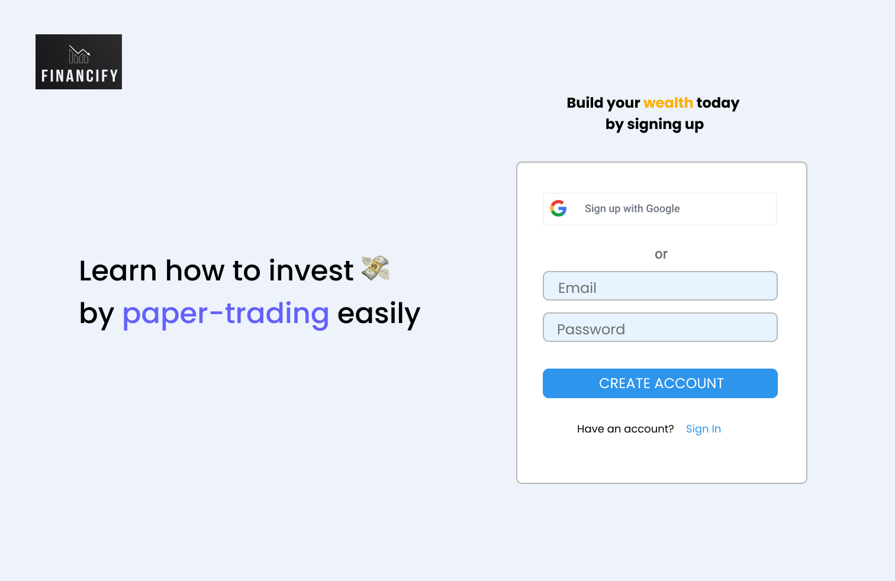
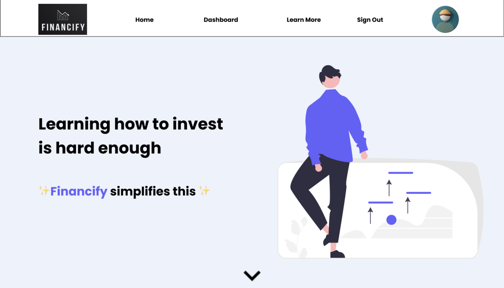
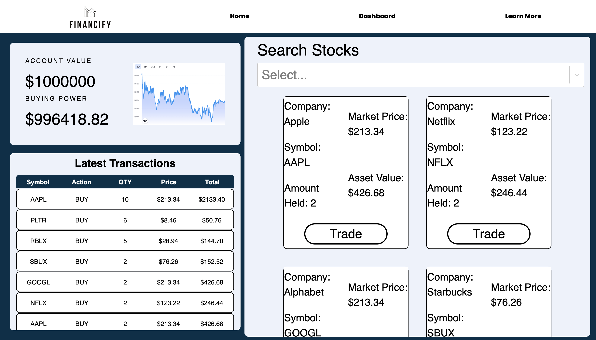
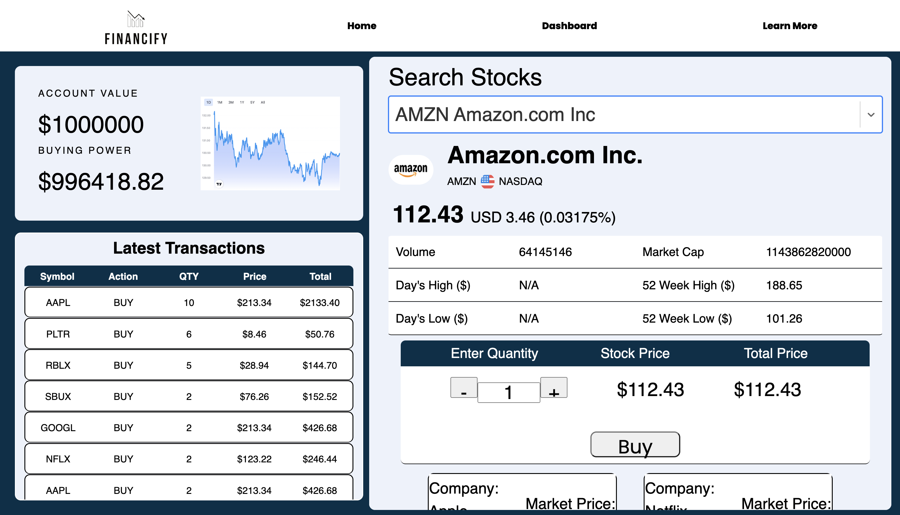

# 📈 Financify App 📈

Financify is a intuitive web application that is that will serve to help users learn how to buy and sell stocks with out using their own money. The app utilizes paper money to simulate trading with stocks while gaining financial literacy skills and empowerment with investing.

## 👩🏽‍🚀 Feature List:
* Buy and sell stocks using real-time stock data
* Store your most recent stock transactions
* View individual stocks from your portfolio
* View all recipes items stored
* View stock portfolio data

## 🎨 Wireframe

<div>





</div>

[Figma UX Design](https://www.figma.com/file/seXFjKic8dSObWZzudN7J3/Financiify-Paper-Trading-App---UX?node-id=0%3A1)


## 🚀 MVP:
The primary goal is to make an web application that allows users to make stock purchases on any stock of their liking. By using our search engine we return real-time stock data on user's stock purchase. Our app will feature the ability to purchase and sell stocks and view history of stock transactions.

## 🥳 Post MVP (Extras)
* Using Google authentication for more personalized stock purchases
* Recipe Search Query
* Google Images API
* Sort read items
* Parsing rating in hours and minutes
* Addition of favorites field by boolean
* Google Authentication for personalized experience

## 🔨 Back-end Endpoints
Routes:
* view all: "/stocks"
* create new: "/stocks"
* update one: "/stocks/:id"

## 🗒️ Component Hierarchy
```
  src/
    components/
        routes/
            Dashboard.js
            DisplayStock.js
            DisplayStocks.js
            Form.js
            LandingPage.js
            Home.js
            Stock.js
            StockProfile.js
            StockPurchase.js
            TrendStocks.js
        shared/
            Footer.js
            Layout.js
            Navigation.js
    ...
```
## 📦 List Dependencies 

Front-End:
* React
* HTML
* CSS
* Axios
* Netlify

Backend:
* Node.js
* Express
* MongoDB
* Heroku


## 👨‍💻 Authors
* Anthony Tapia
* George Sucuzhanay
